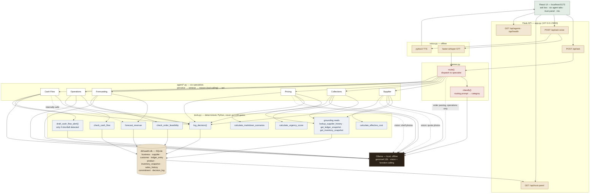

# Ledgr — Multi-Agent SME Advisor

On-device, agentic business advisor for the Build with Gemma: Bengaluru AI
Sprint (Track 3). All five specialist agents named in the track brief —
Supplier, Collections, Pricing, Forecasting, and Operational Planning — are
now live, routed through a planner. This covers the full P0 scope from the
build plan; everything from here is P1/P2 polish (voice, camera grounding,
fine-tuning, eval harness, trust-panel UI).

## Architecture

A request flows: **browser → Flask API → planner → one of six specialist
agents → a deterministic tool in `tools.py` → SQLite**, then the model
interprets the result rather than computing it itself. Every layer that
touches Ollama is on-device — nothing here ever calls out to the network.



### Six agents at a glance

| # | Agent | Owner's question | Required tool (never an LLM guess) |
|---|-------|-------------------|--------------------------------------|
| 01 | **Supplier** | "Which supplier quote should I take?" | `calculate_effective_cost` |
| 02 | **Collections** | "Who should I chase for payment?" | `calculate_urgency_score` |
| 03 | **Pricing** | "What do I do with stock about to spoil?" | `calculate_markdown_scenarios` |
| 04 | **Forecasting** | "What will revenue look like?" | `forecast_revenue` |
| 05 | **Operations** | "Should I accept this bulk order?" | `check_order_feasibility` |
| 06 | **Cash Flow** | "Am I heading into a cash crunch?" | `check_cash_flow` |

### Reading the diagram

- **One model, two jobs, zero network calls.** Every box touching `OLLAMA`
  is a local `gemma4:12b` call — routing, vision extraction, tool-calling
  reasoning, and message drafting all happen on-device.
- **The model never invents a number.** Each agent's calculation runs
  through a real Python function in `tools.py` before Gemma reasons over
  the result — it interprets, it doesn't compute.
- **`tools.py` is the only thing that touches SQLite.** Agents and the
  planner never open a DB connection directly, which is what makes the
  trust panel a complete audit trail rather than a UI over scattered
  writes.
- **Cash Flow is the odd one out, on purpose.** It's the only agent with a
  second, conditional LLM call (`draft_cash_flow_alert`) — it only fires
  when `check_cash_flow` actually reports a shortfall.
- **Voice is a wrapper, not a fork.** `/api/ask-voice` transcribes offline,
  then hands the transcript to the exact same `planner.route()` every typed
  query goes through.

Full write-up with more detail: [`docs/architecture.md`](docs/architecture.md).

## What it does

**Supplier Agent** — give it photos of 2-3 supplier quote slips (handwritten, printed, or a WhatsApp screenshot). It:
1. **Perceives** — reads each photo directly with Gemma's vision, no separate OCR step.
2. **Retrieves** — grounds each supplier in their real history from a local SQLite DB (on-time rate, past quality issues, notes).
3. **Reasons** — calls a real cost-calculation tool (not an LLM guess) factoring in payment terms and delivery risk, weighs it against supplier reliability, and picks one.
4. **Acts** — drafts a counter-offer message if there's something worth negotiating.

**Collections Agent** — reasons over the business's outstanding customer ledger. It:
1. **Perceives** — either reads photographed ledger/khata pages via Gemma vision, or works directly off seeded ledger data.
2. **Retrieves** — pulls each customer's relationship history and prior notes.
3. **Reasons** — computes a baseline urgency score (real math), then explicitly weighs it against relationship/status notes rather than just sorting by amount owed — the whole point is a loyal 5-year customer and a newly-quiet one don't get treated the same even at similar numbers.
4. **Acts** — drafts a tone-appropriate reminder per customer worth following up with, in their preferred language.

**Pricing Agent** — reasons about stock that's about to spoil. It:
1. **Retrieves** — pulls the current perishable inventory snapshot (quantity, days until spoilage, cost/sell price).
2. **Reasons** — calls a real markdown-scenario calculator (not an LLM guess) that models expected revenue/profit at several discount depths against the risk of losing the stock entirely, then interprets which discount level actually makes sense per item rather than defaulting to the deepest one.
3. **Acts** — drafts a shelf-tag/WhatsApp-style markdown announcement for whatever it recommends.

**Forecasting Agent** — the one hybrid piece: Gemma does not estimate revenue itself. It calls `forecast_revenue`, a real linear-trend + day-of-week-seasonality model (pure Python, no numpy/pandas dependency) fit on historical daily sales, and its only job is to interpret that output — trend direction, strongest/weakest days, confidence level — never to invent a number that didn't come from the model.

**Operational Planning Agent** — decides whether to accept a bulk order. It calls `check_order_feasibility`, which checks real stock levels against existing commitments (so a new order can't silently overcommit inventory already promised elsewhere) and computes the actual profit at the requested price/discount — then reasons about whether to accept, negotiate, or decline, and drafts the reply.

A **planner** (`agent/planner.py`) classifies what the owner is asking for and routes to the right agent.

Everything runs locally against Ollama. No cloud API touches the data.

## Setup

```bash
# 1. Install Ollama (https://ollama.com) and pull Gemma 4
ollama pull gemma4:12b   # 12B Unified — multimodal (vision+audio) + native function-calling

# 2. Python deps
pip install -r requirements.txt

# 3. Seed the demo database
python db/seed_data.py

# 4. Run against sample quote images (Supplier Agent)
python sample_data/generate_samples.py   # synthetic quote images for dev/testing
python agent/supplier_agent.py sample_data/quote1_balaji.png sample_data/quote2_krishna.png sample_data/quote3_newblr.png

# 5. Run the Collections Agent against seeded ledger data
python agent/collections_agent.py

# 6. Run the Pricing Agent against seeded perishable inventory
python agent/pricing_agent.py

# 7. Run the Forecasting Agent against 90 days of seeded sales history
python agent/forecasting_agent.py 14   # 14-day horizon

# 8. Run the Operational Planning Agent against a sample bulk order
python agent/operations_agent.py

# 9. Or go through the planner (routes to whichever agent fits the query)
python agent/planner.py "which cement supplier should I go with"
python agent/planner.py "who should I follow up with for payment this week"
python agent/planner.py "what should I do with the tomatoes before they go bad"
python agent/planner.py "what will my revenue look like over the next two weeks"
python agent/planner.py "should I take a bulk cement order"
```

## What you still need to add

- **`sample_data/`** — swap the synthetic quote images for real or realistically
  messy photos (handwritten, skewed, mixed language) before the live demo —
  Gemma reading genuinely messy handwriting live is the actual wow moment.
- **Real ledger photos** — Collections Agent works off seeded data out of the
  box; add photographed khata pages via `collections_agent.run(business_name, ledger_image_paths=[...])`
  once you have some to test extraction against.
- **Model tag** — `agent/llm_client.py` has `MODEL_NAME = "gemma4:12b"` (the
  Unified multimodal variant). If you pull a different size (e.g. `e4b` for
  a lighter/faster run), update `MODEL_NAME` to match.
- **Fuzzy supplier matching** — `tools.lookup_supplier_history` does a naive
  substring match on the first word of the name. Fine for a demo with 3
  seeded suppliers; worth hardening if extraction names get messier.

## P0 + first two P1 items are done — what's next

Done:
- All five specialist agents, routed through the planner.
- **Trust panel (UI)** — `app.py` is a minimal local Flask app: an ask box
  (text + optional photo upload) that routes through the planner, and a
  `/trust-panel` page reading straight from `decision_log` so every
  recommendation shows its reasoning and evidence, not a black box.
- **Query-to-parameters parsing for Operational Planning** — the planner
  now parses product/quantity/discount out of a free-text order message
  before handing off to `operations_agent`, same as the other four agents
  inferring everything from the query/photos/DB directly.

- **Voice I/O** — `agent/voice.py` (faster-whisper STT + pyttsx3 TTS),
  `/api/ask-voice`, and a mic button in the frontend. Speak a question,
  get a spoken answer back, fully offline.
- **Camera-based inventory grounding** — the Pricing Agent now reads
  shelf/crate photos via Gemma vision (`pricing_agent.perceive_from_images`,
  `SHELF_INVENTORY_PROMPT`) instead of relying only on the seeded
  `inventory_snapshot` baseline. Only updates products already in the
  catalog — a product spotted on camera that isn't in `product` yet gets
  flagged as needing manual price setup rather than guessed at, since the
  markdown math needs real cost/sell prices. Attach a shelf photo the same
  way as a supplier quote — same "attach photos" control in the frontend,
  routed to whichever agent the query maps to.

- **Eval harness** — `tests/`, pytest-based. Pure math tests
  (`test_tools_math.py`) need no Ollama and check the deterministic tools
  directly — effective cost, urgency scores, markdown scenarios, order
  feasibility, forecasting. Integration tests (`test_routing.py`,
  `test_scenarios.py`) need Ollama running and auto-skip otherwise; they
  check planner routing accuracy and that agents degrade honestly on edge
  cases (an infeasible order gets flagged, a loss-making discount gets
  flagged) rather than just agreeing with whatever's asked. Run everything
  with `pytest tests/ -v` from the `saathi/` root.

Still open, pure P2 stretch goals per `saathi_build_plan.md`:
1. **LoRA fine-tuning** on a curated local-tone dataset — do this last, most failure-prone step time-wise.
2. **Agent-vs-agent negotiation rehearsal, preference-learning loop, mobile packaging** — stretch on top of the stretch; only if everything above is demoed solid first.

## Running the backend API

`app.py` is now a JSON API (was server-rendered HTML — moved to a real
React frontend, see `frontend/`).

```bash
pip install -r requirements.txt
python db/seed_data.py
python app.py
```

API is at http://localhost:5000:
- `POST /api/ask` — multipart form (`query` + optional `images` files) or JSON `{"query": "..."}`. Returns `{category, recommendation, error, details?}`.
- `POST /api/ask-voice` — multipart form (`audio` recording). Transcribes offline (faster-whisper), routes through the planner, synthesizes the answer back to speech (pyttsx3). Returns `{transcript, category, recommendation, error, audio_url}`.
- `GET /api/audio/<file>` — serves synthesized TTS audio.
- `GET /api/trust-panel?limit=20` — recent decisions across all agents.
- `GET /api/agents` — static metadata for the five-agent selector UI.
- `GET /api/health` — liveness check.

Voice I/O note: `faster-whisper` downloads a small model (~75-150MB) on
first run — do this once before demo day, not live at the venue. After
that it's fully offline, same as everything else.

## Running the frontend

See `frontend/README.md` for the Vite/React setup. In short:

```bash
cd frontend
npm install
npm run dev
```

Opens on http://localhost:5173 and talks to the backend on :5000 (CORS is
already enabled on the Flask side).

## Project structure

```
saathi/
  requirements.txt
  app.py                   # Flask JSON API: /api/ask, /api/ask-voice, /api/trust-panel, /api/agents
  uploads/                 # photos + voice recordings uploaded via the frontend land here
  audio_out/                # synthesized TTS responses land here
  frontend/                # Vite + React UI (ledger-paper theme), see its own README
  db/
    schema.sql            # SQLite schema — business, supplier, quote, customer, ledger_entry, product, inventory_snapshot, sales_history, commitment, decision_log
    seed_data.py           # demo business + suppliers/customers/perishable inventory/90 days sales history/commitments, all with contrasting scenarios
    saathi.db              # created by seed_data.py
  agent/
    llm_client.py           # Ollama wrapper (chat + vision)
    prompts.py              # all prompt templates in one place
    tools.py                 # tool functions (shared + per-agent) + Ollama function-calling schema
    supplier_agent.py        # Supplier Agent: perceive/retrieve/reason/act loop
    collections_agent.py     # Collections Agent: perceive/retrieve/reason/act loop
    pricing_agent.py         # Pricing Agent: retrieve/reason/act loop (markdown decisions)
    forecasting_agent.py     # Forecasting Agent: reason/act loop wrapping a real trend+seasonality model
    operations_agent.py      # Operational Planning Agent: reason/act loop wrapping real stock/profit math
    voice.py                  # offline STT (faster-whisper) + TTS (pyttsx3)
    planner.py                # routes owner queries to the right specialist agent
  sample_data/
    generate_samples.py      # synthetic quote-slip image generator for dev/testing
  tests/
    conftest.py               # seeds the DB, detects whether Ollama is reachable
    test_tools_math.py         # pure arithmetic tests, no Ollama needed
    test_routing.py             # planner routing accuracy (needs Ollama)
    test_scenarios.py            # honest-degradation checks (needs Ollama)
```
