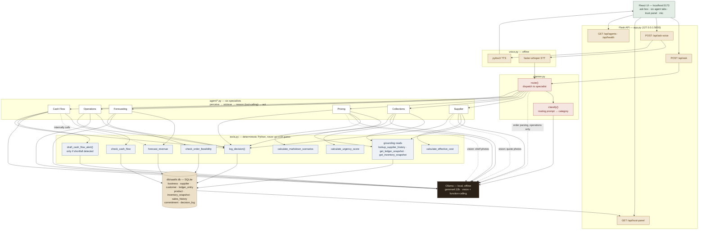

# Ledgr — Architecture

Six specialist agents behind one planner, a deterministic math/DB layer that the model is required to call rather than guess through, and a single local model (`gemma4:12b` via Ollama) that never talks to the network. This diagram traces a request from the browser down to SQLite and back.

## Reading the diagram

- **One model, two jobs, zero network calls.** Every box that touches `OLLAMA` is talking to a local `gemma4:12b` instance — routing classification, vision extraction, tool-calling reasoning, and message drafting all happen on-device. Nothing here ever leaves the machine.
- **The model never invents a number.** Each agent's calculation runs through a real Python function in `tools.py` — `calculate_effective_cost`, `forecast_revenue`, `check_cash_flow`, etc. — before Gemma is allowed to reason over the result. The model interprets; it doesn't compute.
- **`tools.py` is the only thing that touches SQLite.** Agents and the planner never open a DB connection directly — every grounding read and every write (including `log_decision`) goes through this one module, which is what makes the trust panel a complete, honest audit trail rather than a UI built on top of scattered writes.
- **Cash Flow is the odd one out, on purpose.** It's the only agent with a second, conditional LLM call (`draft_cash_flow_alert`) — it only fires when `check_cash_flow` actually reports a shortfall, so a healthy cash position never manufactures an alert.
- **Voice is a wrapper, not a fork.** `/api/ask-voice` transcribes offline (faster-whisper), then hands the transcript to the exact same `planner.route()` every typed query goes through — there's no separate voice-only logic path to keep in sync.
